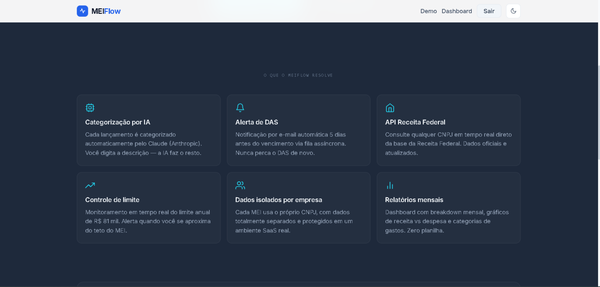
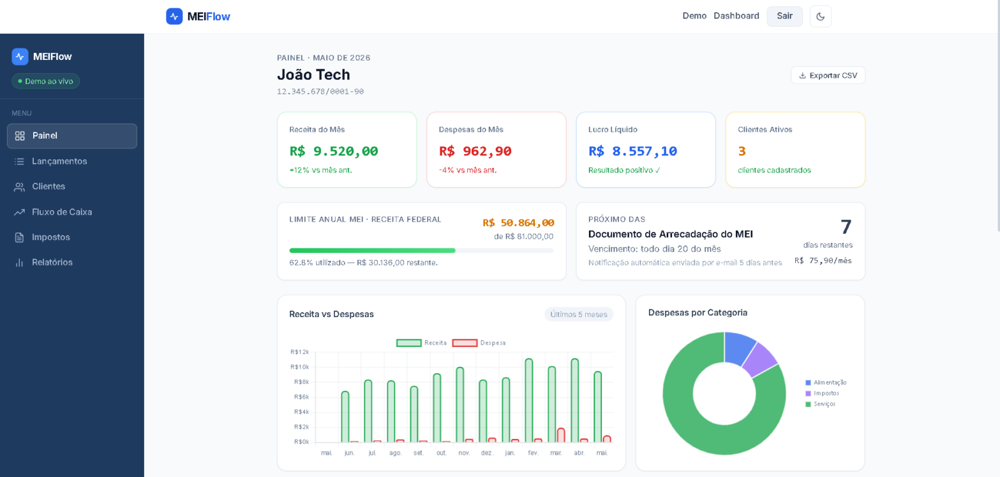
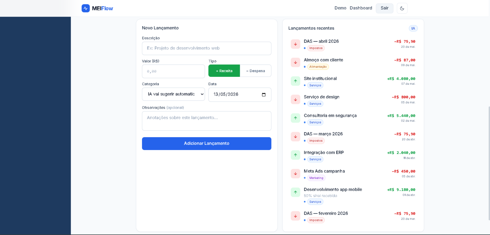
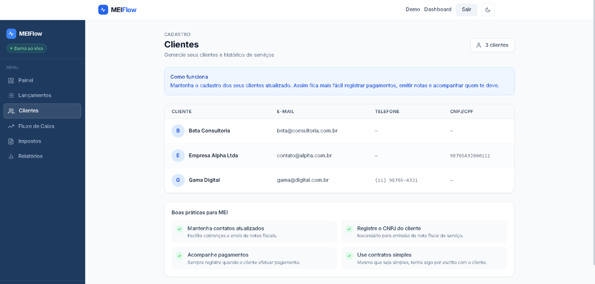
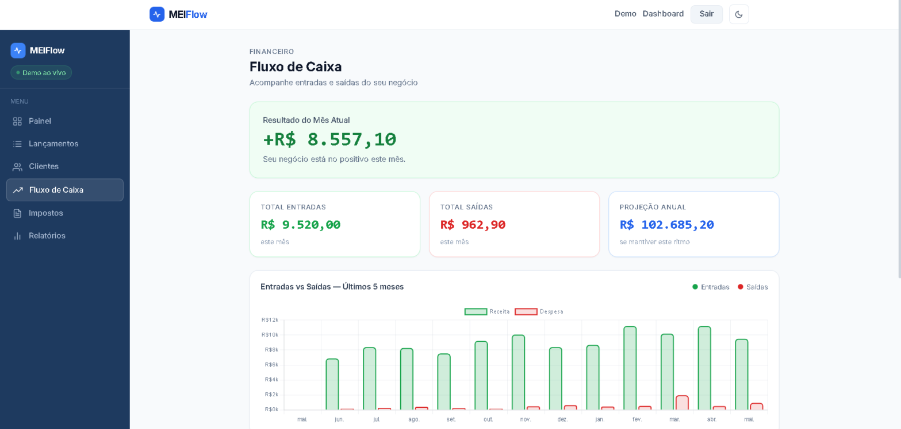
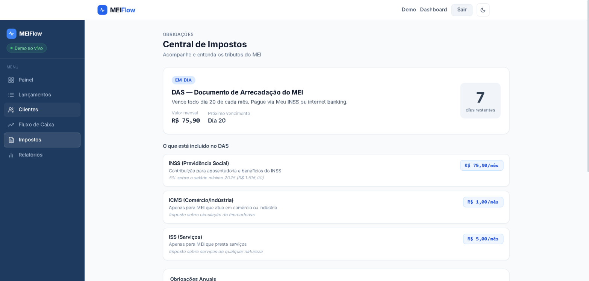
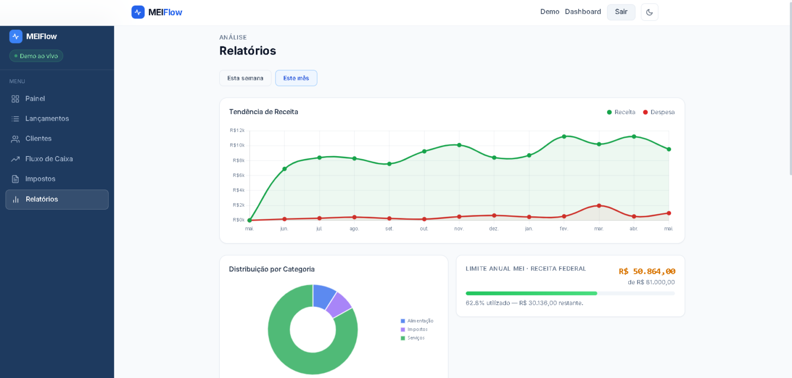
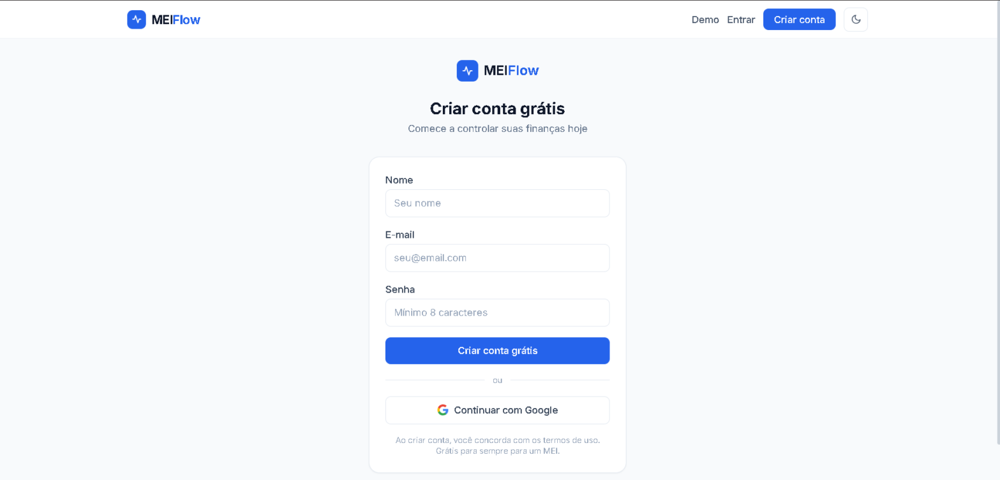

# MEIFlow

> SaaS de gestão financeira construído do zero para os 15 milhões de MEIs do Brasil.

[](https://mei-flow-eight.vercel.app)
[](https://nextjs.org)
[](https://typescriptlang.org)
[](https://prisma.io)

**🚀 [Demo ao vivo → mei-flow-eight.vercel.app](https://mei-flow-eight.vercel.app)**

---

## O Problema

São **15 milhões de MEIs no Brasil**. A esmagadora maioria controla receitas, despesas e impostos em caderno, WhatsApp ou planilha. Os sistemas existentes são caros demais, ou tão complexos que assustam quem nunca teve contador.

**Não existe nada simples, bonito e feito especificamente para a realidade de quem trabalha sozinho.**

MEIFlow resolve isso.

---


---

## O que foi construído

Uma aplicação **multi-tenant real** — cada MEI tem dados completamente isolados, identificados pelo próprio CNPJ. O sistema é operacional em produção com usuários reais.



### Funcionalidades em produção

- **Categorização por IA** — cada lançamento é categorizado automaticamente pelo Claude (Anthropic). O usuário digita a descrição; a IA faz o resto, com fallback heurístico sem custo de API
- **Alerta de DAS automático** — e-mail enviado 5 dias antes do vencimento via Vercel Cron Jobs + Resend. Nunca mais pagar multa
- **API Receita Federal ao vivo** — consulta de CNPJ em tempo real direto da base pública. Onboarding em segundos
- **Controle do limite anual** — monitoramento do teto de R$81.000 com barra de progresso e alertas progressivos
- **Relatórios mensais** — evolução mês a mês, tendência de receita, distribuição por categoria, melhor mês
- **Autenticação completa** — Google OAuth + e-mail/senha, sessões JWT, middleware de rota por tenant

---

## Dashboard



KPIs em tempo real: receita do mês, despesas, lucro líquido, clientes ativos, limite MEI e próximo vencimento do DAS — tudo em uma tela.

## Lançamentos com IA



Formulário com sugestão de categoria por IA. Histórico filtrável por semana, mês e ano. Exportação CSV nativa.

## Gestão de Clientes



Cadastro de clientes com envio automático de e-mail de boas-vindas via Resend. Domínio verificado, remetente profissional.

## Fluxo de Caixa



Projeção anual calculada em tempo real. Gráfico de entradas vs saídas dos últimos 5 meses.

## Central de Impostos



Breakdown completo do DAS 2025 com countdown do vencimento. Links diretos para o Portal do Empreendedor, PGMEI e Meu INSS.

## Relatórios



Tendência de receita, distribuição por categoria e evolução mensal completa — sem planilha, sem contador.

---

## Arquitetura

```
[Usuário] ──► [Next.js App Router] ──► [Middleware JWT + tenant check]
                      │
          ┌───────────┼───────────────────┐
          │           │                   │
    [Dashboard]  [API Routes]      [Server Pages]
          │           │                   │
          └───────────▼───────────────────┘
                [Prisma ORM]
                      │
              [PostgreSQL / Neon]
                      
[Vercel Cron] ──► [/api/cron/das] ──► [Resend] ──► [E-mail MEI]
[Formulário]  ──► [/api/categorize] ──► [Claude API] ──► [categoria]
[Onboarding]  ──► [/api/cnpj] ──► [BrasilAPI / Receita Federal]
```

## Stack

| Camada | Tecnologia |
|--------|-----------|
| Frontend | Next.js 14 App Router · TypeScript strict · Tailwind CSS |
| Auth | NextAuth.js · Google OAuth · JWT |
| Backend | Next.js API Routes |
| Banco de dados | PostgreSQL · Neon serverless · Prisma ORM |
| IA | Claude 3 Haiku (Anthropic) |
| E-mail | Resend · domínio verificado |
| Cron | Vercel Cron Jobs |
| Deploy | Vercel (frontend + API) · Neon (banco) |

---

## Cadastro



---

Construído por [João Lacerda](https://joaolacerda.dev) · 15 milhões de MEIs merecem ferramentas melhores.

